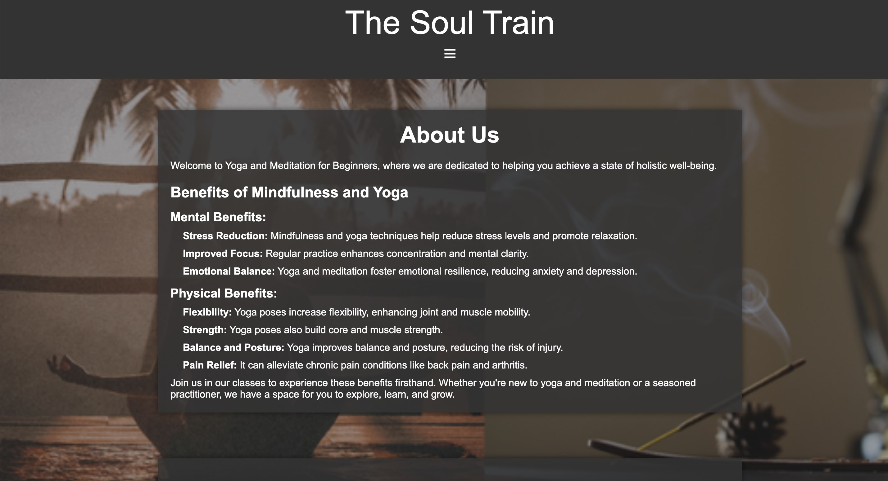
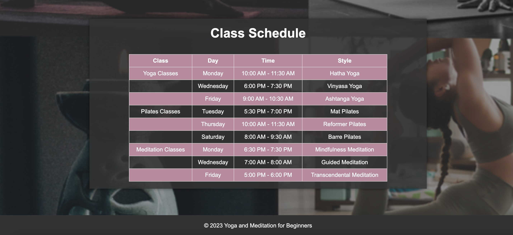
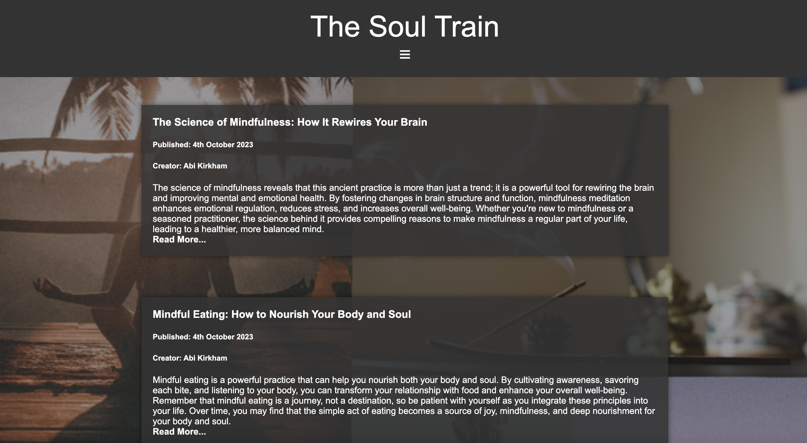
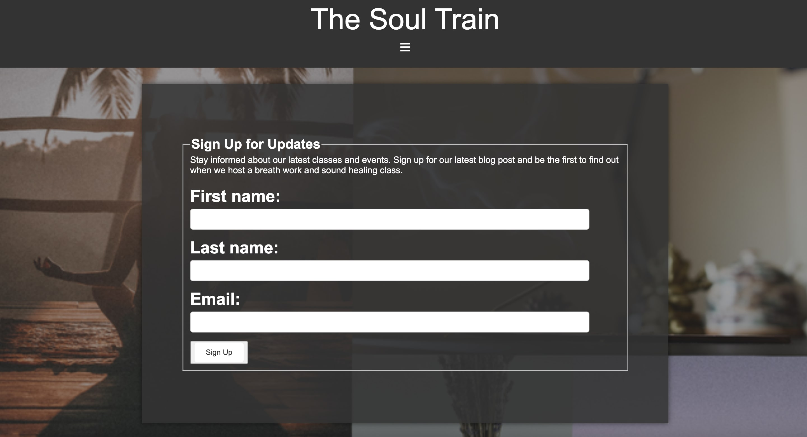

# The Soul Lane: Navigating Life with Mindfulness and Meditation :lotus_position_woman:

Welcome to **The Soul Lane**, your digital haven designed to help you navigate the challenges of modern life through the power of mindfulness and meditation. In today's fast-paced world, rife with stress and anxiety, this sanctuary offers inner peace and resilience, empowering you to discover clarity in the midst of chaos for a happier and healthier life. The live link can be accessed [here](<https://abikirkham.github.io/the-soul-train/index.html>).

## My Vision

At *The Soul Lane*, I promote mindfulness and meditation as essential practices for overall well-being. Understanding the demands of modern life, my vision is to provide accessible guidance for managing stress, anxiety, and daily challenges. Through mindfulness and meditation, discover a sense of balance and harmony amidst the chaos.

## Features to Empower You

### Home Page
Your digital doorway featuring engaging visuals, concise descriptions, and inspirational quotes. The home page aims to pique curiosity and inspire a deeper exploration.

### About Page :dizzy:

Explore the heart of my mission, offering resources like sound healing audio and yoga essentials for an enhanced mindfulness journey.

### Class Schedule Page :calendar:
Access an updated schedule of yoga, pilates, and meditation classes for active participation and seamless integration into daily routines.

### Blog Page
Insightful blogs on mindful eating and crystals provide knowledge and skills to enhance your mindfulness journey.

### Contact Page
Establish a direct line of communication for personalized guidance, fostering a sense of belonging and support.

## Existing Features

### Navigation Bar
Consistent across all pages, ensuring smooth and intuitive navigation for a seamless user experience. Creating a smooth interaction which can be seen easy on the eyes ... *almost peaceful.*

### Landing Page
A captivating point of entry with visually appealing, simplistic classe timetables, introducing the mission of *The Soul Lane*. Creating easy access for those who have accessed the page previosuly and wanted to jump straight to the classes. 

### Club Ethos
Outlining the benefits of joining youga, pilates and medication for beginners, encouraging peacefullness to the soul, joinginh the training journey.

### Meetup Times
Crucial and real-time information about the schedules, introductions, and defintions for what each class means.

### Footer
Strategically positioned footer, reminding this is for beginners.

## Accessibility and Transparency

### Accessibility Statement
Committed to making *The Soul Lane* accessible to all users, complying with accessibility standards such as WCAG.

### Contact Information
Readily available contact information for questions, feedback, or accessibility concerns.

## Testing

# Responsive Design

Ensure the project is responsive across various screen sizes and browsers, adhering to the WCAG 2.1 Reflow criteria.

### Testing Procedure

1. Open your preferred browser and visit the Yoga for Beginners website.
2. Access developer tools by right-clicking and selecting inspect.
3. Set the view to responsive and reduce the width to 320px.
4. Adjust the zoom to 50%.
5. Drag the responsive window to its maximum width.

## Accessibility

Utilize the Wave Accessibility tool for ongoing development and final testing. Concentrate on the following criteria:

1. Ensure all forms have associated labels or appropriate aria-labels.
2. Validate that color contrasts meet the minimum ratios outlined in WCAG 2.1 Contrast Guidelines.
3. Verify correct heading levels to accurately convey content importance.
4. Confirm content is organized within landmarks for ease of use with assistive technology.
5. Provide alternative text or titles for non-textual content.
6. Set the HTML page lang attribute.
7. Implement Aria properties in adherence to best practices outlined in WCAG 2.1.
8. Follow established coding best practices for WCAG 2.1.

### Manual Testing

Identified accessibility issues:

**Issue #1:**
Hidden checkboxes and labels for the gallery filter and accordion were inaccessible via keyboard due to the use of `display: none;`. Used for the navigation, including the icons, such as, ☰, which i found from Microaoft word keyboard.

## Deployment

*The Soul Lane* is hosted on GitHub Pages, offering easy access to content and services. The deployment process involves selecting the Master Branch in the GitHub repository's Settings tab, with the live link providing direct access.

## Credits

I extend gratitude to Code Institute for knowledge in HTML and CSS, enabling me to bring my ideas to life. The transformative journey from a nursing career to coding unveiled the healing power of meditation and yoga, essential tools in navigating the transition.

I have taken some skills I have learnt from code institute such as the drop down boxes and incorporated it with some extra leanring on navigation options, which can be found [here](<https://www.youtube.com/watch?v=iXKScihfSwE>).

Creating better visual effects for my users experience was impirtant,I added an extra colour to links for users to know it was a link when they hovered their cursor of over the link. I got this informstion from [here](<https://developer.mozilla.org/en-US/docs/Web/CSS/:hover#>). 

Finally, I wanted to create a simple, soft, emotional vibe to my styles, by adding the opaque style to the containers - information found [here](<https://developer.mozilla.org/en-US/docs/Learn/CSS/Howto/Make_box_transparent>). Aswell as creating a background which relates to the activties of the page - this to me, created a chnnce for users to get a feel of what they could experience when practising our yoga. The images used were sourced from [freeimages](<https://www.freeimages.com>) I then created the background using this [app](<https://www.sketchbook.com>) by collating the images and added a shadow to the images on top so this would not be harsh on the eyes.
